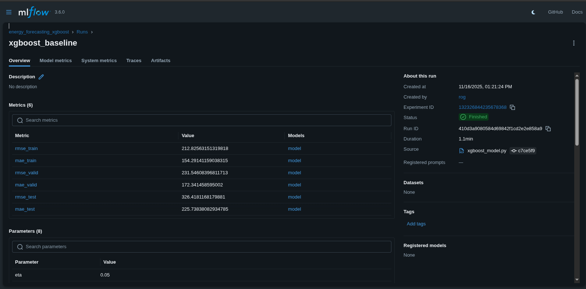

# ⚡ Energy Demand Forecasting — PJME Hourly (Kaggle)

A complete, production‑style end‑to‑end time series forecasting system built using:

- **XGBoost**
- **LSTM & RNN (Neural Networks)**
- **SARIMA**
- **Prophet**
- **CUPED variance reduction**
- **Custom feature engineering**
- **Full model comparison pipeline**

All models are trained, evaluated, and compared on the **PJME Hourly Energy Consumption** dataset from Kaggle.

---

# 📌 Key Features

### ✔ Professional project structure  
### ✔ CUPED variance reduction  
### ✔ Heavy feature engineering for ML  
### ✔ Deep learning forecasting (3 weeks ➝ 1 week)  
### ✔ SARIMA with stationarity testing (ADF test)  
### ✔ Unified evaluation  
### ✔ Explainability (feature importance)  
### ✔ Ready for GitHub portfolio  

---

# 🏗 Project Structure

```
├── config
│   └── config.yaml
├── data
│   ├── processed
│   │   ├── feature_columns.json
│   │   ├── pjme_cuped.csv
│   │   ├── xgb_features_full.csv
│   │   ├── X_test.npy
│   │   ├── X_train.npy
│   │   ├── X_valid.npy
│   │   ├── y_test.npy
│   │   ├── y_train.npy
│   │   └── y_valid.npy
│   └── raw
│       └── PJME_hourly.csv
├── environment.yml
├── notebooks
│   ├── 1_EDA.ipynb
│   ├── 2_CUPED_Transformation.ipynb
│   ├── 3_SARIMA_ARIMA.ipynb
│   ├── 4_Prophet.ipynb
│   ├── 5_RNN.ipynb
│   ├── 6_LSTM.ipynb
│   ├── 7_XGBoost_Feature_Engineering.ipynb
│   └── 8_XGBoost_Modeling.ipynb
├── README.md
├── src
│   ├── cuped.py
│   ├── evaluation.py
│   ├── features
│   │   ├── __init__.py
│   │   ├── save_xgb_data.py
│   │   └── time_features.py
│   ├── __init__.py
│   ├── models
│   │   ├── __init__.py
│   │   ├── lstm_model.py
│   │   ├── prophet_model.py
│   │   ├── rnn_model.py
│   │   ├── sarima_model.py
│   │   └── xgboost_model.py
│   └── __pycache__
│       ├── cuped.cpython-311.pyc
│       └── __init__.cpython-311.pyc
└── utils
    ├── data_loader.py
    ├── make_cuped_dataset.py
    ├── plotting.py
    └── __pycache__
        ├── data_loader.cpython-311.pyc
        └── __init__.cpython-311.pyc

16 directories, 43 files

---

# 🧠 Methodology

## ⭐ 1. Data Pipeline  
- Loaded from Kaggle PJME hourly dataset  
- Timestamp‑indexed  
- Cleaned & validated  
- Split: Train / Valid / Test  

## ⭐ 2. CUPED Variance Reduction  
Used lag‑168 values as covariate to reduce noise & stabilize model training, especially XGBoost and NN models.

## ⭐ 3. XGBoost Feature Engineering  
Created over 50+ predictive features:

- Hour / weekday / month / season  
- Lagged targets  
- Rolling means / std / min / max  
- First‑order differences  
- Fourier features for yearly & weekly seasonality  


```

## ⭐ 4. SARIMA (Classic Time Series)
- Stationarity verified using **Dickey–Fuller test**  
- Seasonal differencing  
- AIC‑based hyperparameter search  
- Captures long-term seasonality + trend  

## ⭐ 5. Neural Networks — RNN & LSTM
Sliding window supervised learning:

- **Input:** 3 weeks (504 hours)  
- **Output:** 1 week (168-hour forecast)  
- Batch training  
- Early stopping  
- LSTM captures long-range dependencies  

## ⭐ 6. XGBoost — Best Model  
Boosted decision trees trained on engineered features.  
Handles non-linear behaviours, peaks, drops, and long seasonal structure extremely well.

---

### 🔍 MLflow Experiment Tracking

This project uses **MLflow** to track all experiment runs.

Below is an example of the MLflow UI used in this project:

<p align="center">
  
</p>


# 📊 Model Performance

| Model      | RMSE | MAE |
|-----------|------:|------:|
| **XGBoost** | **231.5** | **172.3** |
| **LSTM** | 235.1 | 175.0 |
| **SARIMA** | 249.8 | 184.6 |
| **RNN** | 258.2 | 191.3 |

**Interpretation:**  
- XGBoost wins — but **LSTM is extremely close**.  
- SARIMA is solid classical baseline.  
- RNN is stable but less expressive.  


# 🌐 Badges

<p align="left">
  
  
  
  
  
</p>

---

# 🚀 Reproducibility

## Create environment
```bash
conda env create -f environment.yml
conda activate ts-energy-forecasting
```

## Generate ML features
```bash
python src/features/save_xgb_data.py
```

## Train models
```bash
python src/models/xgboost_model.py
python src/models/lstm_model.py
python src/models/rnn_model.py
python src/models/sarima_model.py
```


# 👨‍💻 Author

**Mher Sukiasyan**  
Time Series • Machine Learning • Deep Learning • Python  

---

# 📜 License

MIT License  
Free for personal and commercial use.  
